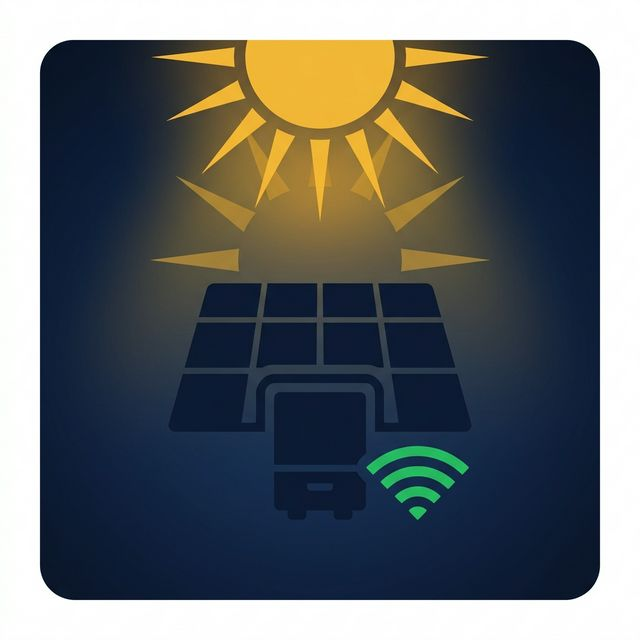

# ☀️ Siseli Inverter Bridge for Home Assistant

[](siseli_bridge/CHANGELOG.md)
[](https://github.com/fadmaz/siseli-ha/actions/workflows/ci.yml)
[](https://www.home-assistant.io/)
[](LICENSE)



A Home Assistant add-on that reads your Siseli-compatible solar inverter **locally**, by
decoding the telemetry it already sends to the vendor cloud — and publishes it to Home
Assistant through MQTT auto-discovery.

Your inverter keeps talking to the cloud, so the official mobile app carries on working.
The bridge sits in the path and relays that connection unchanged; it reads the telemetry
on the way through and never injects anything into it. The only frames it originates
toward the inverter are the ARP replies that put it in the path.

**207 sensors across 7 devices**, 143 enabled on a fresh install. No cloud API, no
polling, no credentials for anything but your own broker.

> **Acknowledgment:** an expanded and generalized fork of the original work at
> [yuraantonov11/siseli-ha](https://github.com/yuraantonov11/siseli-ha). Huge thanks to
> the original author.

---

## Install

**Settings → Add-ons → Add-on Store → ⋮ → Repositories**, then add:

```
https://github.com/fadmaz/siseli-ha
```

Install **Siseli Inverter Bridge**, then follow
**[the documentation](siseli_bridge/DOCS.md)** — requirements, every configuration
option, network setup and troubleshooting. Home Assistant renders that same page on the
add-on's **Documentation** tab once it is installed.

---

## How it works

Your inverter's WiFi dongle publishes telemetry over MQTT to the Siseli cloud at
`8.212.18.157:1883`. The add-on:

1. **Puts itself in the path** using ARP interception, so the inverter's packets reach
   the Home Assistant host.
2. **Reassembles the TCP stream** and pulls out the MQTT PUBLISH frames.
3. **Decodes the payload** — base64 blocks keyed by four-character names (`2ONL`, `WdRR`,
   `Yavb`, …), each a list of space-separated values read by position.
4. **Publishes to your broker** with MQTT auto-discovery, so entities appear on their own.
5. **Forwards the cloud connection onward**, unchanged, along with everything the router
   sends back. Of the inverter's own traffic, that connection is all it relays by default:
   the rest (DNS, NTP, …) is dropped unless you enable
   `FORWARD_ALL_INVERTER_TRAFFIC` — see
   [A caveat on forwarding](siseli_bridge/DOCS.md#a-caveat-on-forwarding).

It never terminates a connection and never opens a listening socket. It observes, decodes,
and relays.

**What this means in practice:** if the add-on stops, your inverter keeps working and the
vendor app keeps working. You lose the Home Assistant sensors, nothing else.

---

## Known limitations

**45 of the 207 sensors read `Unknown` and cannot be decoded.** Earlier versions filled them
with hardcoded constants — fault flags that could never report a fault, a `Mode` that was
a fixed string in the source. Those were removed in 2.6.1. The entities remain, disabled
by default, and publish an explicit "no value" rather than a comforting lie. If your
inverter emits blocks that would decode them, an issue with a capture is welcome.

If instead *every* sensor reads `Unknown`, that is a different situation entirely: your
inverter speaks a protocol this add-on does not decode. The log says so in one line —
see [Every sensor reads Unknown](https://github.com/fadmaz/siseli-ha/blob/main/siseli_bridge/DOCS.md#every-sensor-reads-unknown).

**Two current sources disagree, and there is no way to tell which is right.** The BMS and
the inverter's own ammeter can differ by a factor of two or more, in either direction. The
official app displays both and they disagree there too. The bridge uses the BMS figure and
logs `[ENERGY SOURCE DISAGREEMENT]` when the two diverge, rather than silently picking a
winner. Settling this needs a clamp meter on the DC bus.

**Block positions were reverse-engineered from one device.** There is no published schema.
Values are read by position from blocks whose meaning was inferred. Where a position was
not understood, nothing is published.

---

---

## Supported hardware

Anything using the Siseli IoT cloud platform, which includes inverters sold as:

Solar of Things · LUMINOUS NEO · SUN WISE · Queen Tech · LIB Life · Sun house · LeiLing ·
SunSaviour · ECOmenic · HC solar · 沐能低碳 · PowMr · Taico

**Verified in detail:** one device — `HPVINV04`, firmware `0010.11`, two inverters in
parallel with a 32-cell battery bank. Its captures are byte-faithful fixtures in the test
suite, and the decoded values are checked against the official app.

Other brands on that list are reported to work but are not covered by captures. If you
have one, a debug capture is the single most useful contribution you can make — see
[Troubleshooting](siseli_bridge/DOCS.md#your-inverter-is-not-decoded).

---

---

## Contributing

Development setup, test conventions, how to add a capture from your own inverter, and the
release checklist are in [`CONTRIBUTING.md`](CONTRIBUTING.md).

Release history is in [`siseli_bridge/CHANGELOG.md`](siseli_bridge/CHANGELOG.md), which
Home Assistant also renders on the add-on's **Changelog** tab.

Bug reports: use the [issue templates](.github/ISSUE_TEMPLATE/). Always include your
add-on version and a scrubbed log — this project's experience is that almost every real
defect was found by running it on someone's hardware, not by reading the code.

---

---

## License

[MIT](LICENSE), covering the contributions made in this repository.

The [upstream project](https://github.com/yuraantonov11/siseli-ha) this was forked from
carries no licence of its own, so that grant cannot extend to it. [`NOTICE`](NOTICE) sets
out the distinction, and lists the licences of the bundled dependencies.
